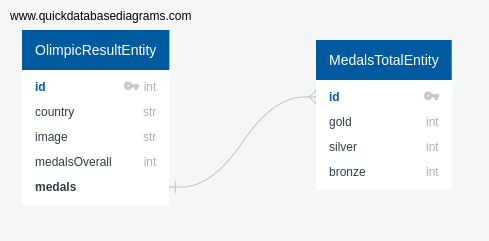

# Codemask

## How to run this project ?

1. Make sure you have docker and docker-compose installed.

```
https://docs.docker.com/compose/install/
https://docs.docker.com/engine/install/
```
2. Clone repository.

3. Change name of .env.template to .env and fill enviroment variables.

4. Then in project root directory run:

```
docker-compose build
docker-compose up
```

Project is up and runnning on `http://localhost:3000`

```
Routes available.
/v1/api/olimpic/results/list, GET} 
/v1/api/olimpic/results/add, POST}
/v1/api/olimpic/results/update/:id, PUT
/v1/api/olimpic/results/remove/:id, DELETE}
```

### ERD diagram


